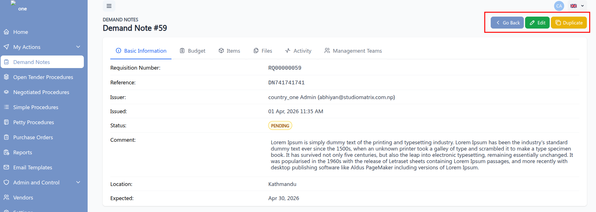

# View Demand Note

The **Demand Note Details** page allows users to view all the information entered while creating a demand note. This page provides a complete overview along with options to navigate, edit, or duplicate the record.

## Accessing the Details Page

- Navigate to the Demand Note listing page
- Click on a specific Demand Note to open its details view

## Overview

The details page displays all the information organized into multiple tabs for better readability and management.

## Tabs Available

### 1. Basic Information
- Displays general details of the demand note such as Requisition Number, Issuer, Issued, Status, Comment, Location and Expected.

### 2. Budget
- Shows the budget-related information associated with the demand note.

### 3. Items
- Lists all items included in the demand note with their respective details.

### 4. Files
- Displays uploaded documents or attachments related to the demand note.

### 5. Activity
- Tracks all actions and updates performed on the demand note.

## Available Actions

At the top of the page, the following action buttons are available:

### Go Back
- Navigates the user to the previous page or listing view.

### Edit
- Allows modification of the existing demand note.
- Opens the demand note in edit mode.

### Duplicate
- Creates a copy of the current demand note.
- Useful for quickly generating a new demand note with similar data.

## Notes

- All tabs are read-only unless the **Edit** option is selected.
- Ensure proper permissions are available to edit or duplicate a demand note.